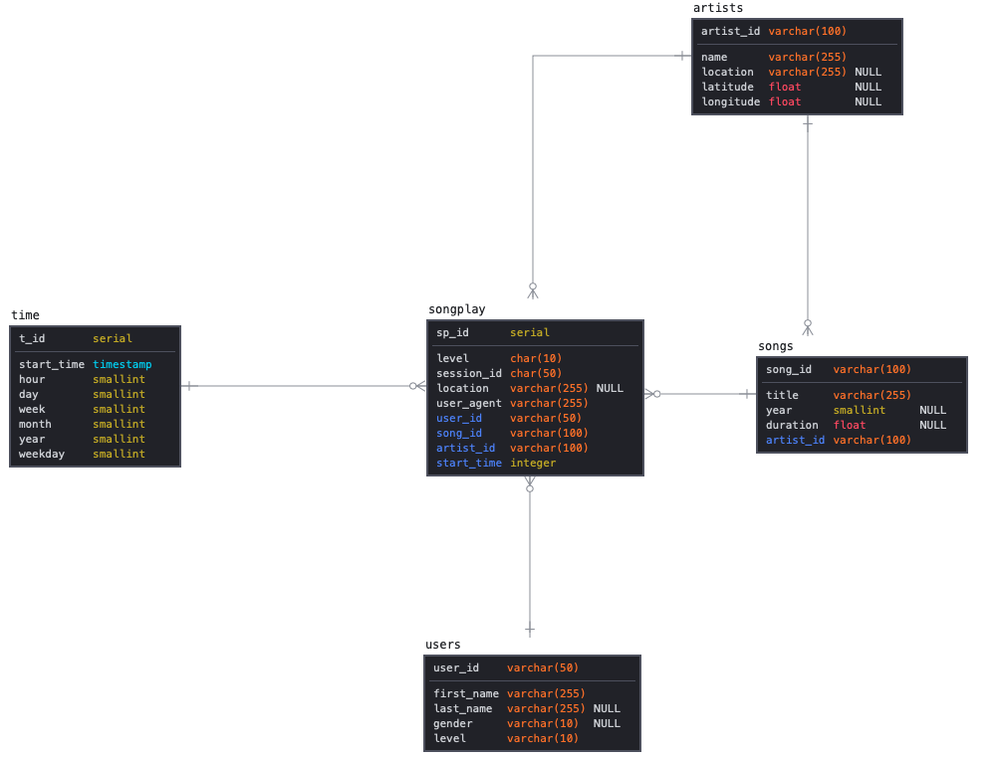

## Data Warehouse in PostGres

1. **Discuss the purpose of this database in the context of the startup, Sparkify, and their analytical goals**

    This warehouse will allow for more robust analytics for Sparkify's business users with a quicker turnaround. Knowledge of customer use, time and locations, artists and their songs allows all business areas to leverage this warehose. Possible but not comprehensive use case would be:
    - **Marketing**: Licensing agreements and negotiations with artists (frequently accessed versus lesser accessed) could be informed by analytics. As could be promotion to specific geographies for the subscription plan (based on time of use)
    - **Operations**: When to provision additional streaming capacity and when to scale back the infrastructure spend 

2. **State and justify your database schema design and ETL pipeline**

    The data warehouse is in a star schema although it could be optimized further. The star schema makes sense as it enables queries with minimum joins. It also allows for the creation of cubes and materialized views that would support reporting and faster ad-hoc analysis. Opportunities to improve/optimize would be:
    - Moving location, level and user agent fields from fact table to user dimension. It belongs there logically and is not of itself additive in any meaningful fashion
    - Songplay duration Startime to Next Song would need to be calculated and added as a fact. This is additive (total time the service was used) but has independent value when combined with dimensions. A song that is not played all the way may not be as valuable even if frequently played/selected by a lot of users
    - Add a foreign key linking user to time dimensions as a significant amount of analysis will likely be focused on Users (time and method of access), and converting them from free to paid
    - Adding serial keys and foreign key relationships especially on fact table so that join fields are not subject to entry error from upstream systems
    - Putting in requirements on data collections and integretity to upstream systems so that logs capture enough and accurate data to prevent as many nulls that exists

### Schema for Sparkify below 

> **Note:** The 'crows feet' notation is indicative of the 'suggested' schema I have proposed. Not the one implemented in the project.

### Files included and their function

1. **create_tables.py:** Open up Terminal and run with `python3 create_tables.py` to drop any existing and create the table structure. It assumes, of course, connection in path to the Postgres instance the script references, a user, etc. etc.
2. **etl.ipynb:** Jupyter notebook to do transformations and test etl. The final **etl.py:** is an outcome of tested transforms and inserts in this notebook
3. **etl.py:** Follow item 1 and run `python3 etl.py` to run the job and hydrate the tables created with the parsed contents of songs and logs.
4. **sql_queries.py:** Removes and centralizes all the queries required for ETL referenced in 3. 
5. Also included are the README.md and SchemaERD image
6. **Not Included:** The data set refwerence in **etl.py:**. Can't figure out how to get it out of Jupyterlab in the Udacity provided environment
